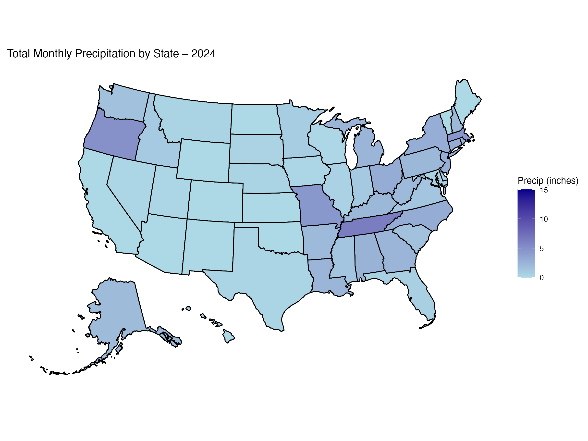

# Predicting Rain-Driven Events

> **Archive status:** This collaborative student project was originally completed in July 2025 and prepared for publication on GitHub as an archival portfolio copy in August 2026. The repository preserves the original analysis while making its file paths and documentation easier to follow. Large and license-restricted datasets are not included, and the original software environment may require adaptation.

## Team

- Jayden Gu
- Brian Zhang
- Steve Sun
- Harry Zhang
- Xiuwen Hu

This project was completed collaboratively. Because the original division of work was not recorded, this archive credits all team members together.

## Project overview

The project explored whether atmospheric measurements could help predict precipitation and severe storm occurrence in the United States. It contains two related modeling tasks:

1. Classifying state-date combinations as storm or non-storm using weather observations from the preceding ten days. The project compares logistic regression with two XGBoost approaches.
2. Predicting hourly precipitation from weather attributes using linear regression and a neural network.

The work is an educational analysis, not an operational weather-warning system.



## Repository contents

```text
Code/
  Data Cleaning-Processing/
    handle.data.py        Combine and clean state-level NOAA files
    emdat.locations.py    Extract state abbreviations from EM-DAT locations
    wideTable.Rmd         Build ten-day weather features and storm labels
  Modeling/
    logisticModel.Rmd     Logistic-regression classifier
    XGBoost.Rmd           XGBoost classifiers
Neural Network/
  GroupProject.Rmd        Linear and neural-network precipitation models
plots/                    Exploratory rainfall visualizations
data/
  README.md               Data acquisition, restrictions, and expected paths
```

Pretrained model files and generated datasets are not included in this archive.

## Data sources

### NOAA Local Climatological Data

Weather observations came from the National Oceanic and Atmospheric Administration's Local Climatological Data product:

- [NOAA Local Climatological Data](https://www.ncei.noaa.gov/products/land-based-station/local-climatological-data)

NOAA's current citation guidance should be followed, with the exact subset, dataset version, and access date recorded when the data are downloaded.

### EM-DAT

Storm-event information came from the Emergency Events Database:

- Emergency Events Database (EM-DAT), UCLouvain/CRED, accessed in 2025, [https://www.emdat.be/](https://www.emdat.be/)
- [EM-DAT terms of use](https://doc.emdat.be/docs/legal/terms-of-use/)
- [EM-DAT citation policy](https://doc.emdat.be/docs/legal/citation-policy/)

EM-DAT records and derived event tables are intentionally omitted. Anyone reproducing the analysis must obtain authorized access independently and comply with the current terms.

See [`data/README.md`](data/README.md) for the required local directory structure.

## Software

The Python cleaning scripts require Python 3 and `pandas`:

```bash
python3 -m pip install -r requirements.txt
```

The R Markdown notebooks use packages including `caret`, `dplyr`, `fastDummies`, `ggplot2`, `here`, `keras`, `pacman`, `reticulate`, `tensorflow`, `tidyverse`, and `xgboost`. The original R, Python, and package versions were not preserved. TensorFlow/Keras configuration is system-specific and may need additional setup.

## Reproducing the pipeline

Run commands from the repository root after placing authorized source files in the locations described in `data/README.md`.

1. Combine and clean the NOAA files:

   ```bash
   python3 "Code/Data Cleaning-Processing/handle.data.py"
   ```

2. Extract EM-DAT state locations:

   ```bash
   python3 "Code/Data Cleaning-Processing/emdat.locations.py"
   ```

3. Knit `Code/Data Cleaning-Processing/wideTable.Rmd` to construct the ten-day feature table.
4. Knit the notebooks in `Code/Modeling/` to train the storm classifiers.
5. Knit `Neural Network/GroupProject.Rmd` to run the precipitation models.

The notebooks retain the original modeling choices and should be read as an archived student analysis. Results can vary across package versions and hardware.

## Known limitations

- Severe storm events are rare relative to non-event dates, creating substantial class imbalance.
- Missing weather values were filled using forward/backward filling or zeros, depending on the variable.
- The original package versions and trained model artifacts were not retained.
- The classification thresholds and model settings were exploratory and were not validated for real-world forecasting.

## License and reuse

No open-source license has been applied to the project code. The code remains the work of the listed contributors. NOAA and EM-DAT materials are governed by their respective source terms and are not licensed by this repository.
